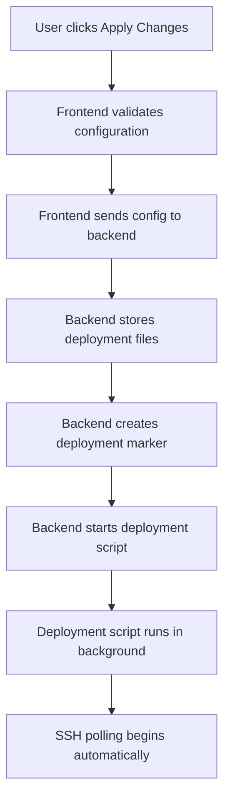

# Deployment Workflow Documentation

This document explains the automated deployment workflow in Pinaka-ZTi-v2.0, specifically how the deployment script is triggered after storing configuration files.

## Workflow Overview

## Detailed Workflow Steps

### 1. User Interaction
- User clicks "Apply Changes" on a node card in either Cloud or Server Virtualization components
- Frontend validates the configuration data
- Configuration data is sent to the backend via `/store-deployment-configs` endpoint

### 2. Backend Processing
The `/store-deployment-configs` endpoint performs these actions:

1. **Configuration Storage**:
   - Receives configuration data from frontend
   - Stores configuration as JSON files in `/home/pinakasupport/.pinaka_wd/cluster/nodes/`
   - Files are named sequentially (node_01.json, node_02.json, etc.)

2. **Deployment Marker Creation**:
   - Creates a marker file at `/home/pinakasupport/.pinaka_wd/.markers/deplyment_status/deployment_in_progress`
   - This marker indicates that deployment is in progress

3. **Deployment Script Execution**:
   - Automatically starts `/home/pinakasupport/.pinaka_wd/.scripts/deployment_service.sh`
   - Script runs in background using `subprocess.Popen()`
   - Uses `start_new_session=True` to ensure independence from parent process
   - Redirects stdout/stderr to DEVNULL to prevent blocking

### 3. Deployment Script
The deployment script (`deployment_service.sh`) performs:
- System configuration based on stored JSON files
- Service initialization and startup
- Node provisioning and networking setup

### 4. SSH Polling Initiation
- After deployment script starts, SSH polling begins automatically
- 90-second delay allows node to reboot and services to start
- Polling checks SSH connectivity every 5 seconds
- Continues for up to 10 minutes (120 attempts)

## Key Implementation Details

### File Storage
- **Location**: `/home/pinakasupport/.pinaka_wd/cluster/nodes/`
- **Naming**: Sequential files (node_01.json, node_02.json, etc.)
- **Format**: JSON with complete node configuration

### Marker Files
- **Purpose**: Track deployment status
- **Location**: `/home/pinakasupport/.pinaka_wd/.markers/deplyment_status/`
- **File**: `deployment_in_progress` (empty file, presence indicates active deployment)

### Script Execution
- **Script**: `/home/pinakasupport/.pinaka_wd/.scripts/deployment_service.sh`
- **Execution Method**: `subprocess.Popen()` with:
  - `start_new_session=True` for process independence
  - `stdout=subprocess.DEVNULL` and `stderr=subprocess.DEVNULL` to prevent blocking
  - Automatic permission setting to ensure executability

## Error Handling

### Script Not Found
- Logs error if deployment script doesn't exist
- Returns error status to frontend

### Permission Issues
- Automatically attempts to set executable permissions
- Continues execution even if permission setting fails

### Execution Failures
- Captures and logs exceptions
- Returns error details to frontend

## Verification

### Backend Logging
The enhanced implementation includes comprehensive logging:
- INFO level for successful operations
- ERROR level for failures
- WARNING level for non-critical issues
- Process ID tracking for debugging

### Frontend Feedback
- User receives immediate feedback when Apply Changes is clicked
- Loading indicators show deployment progress
- Success/error notifications when deployment completes

## Troubleshooting

### Common Issues
1. **Script Not Executing**:
   - Check if script exists at the expected path
   - Verify file permissions (should be executable)
   - Check backend logs for error messages

2. **Deployment Marker Issues**:
   - Ensure directory permissions allow file creation
   - Check if marker file is created after configuration storage

3. **SSH Polling Not Starting**:
   - Verify deployment script is running
   - Check if node is rebooting as expected
   - Review SSH polling logs for connection issues

### Log Locations
- **Backend Logs**: Console output from Flask application
- **Deployment Script Logs**: Dependent on script implementation
- **System Logs**: `/var/log/` directory for system-level issues

## Security Considerations

### File Permissions
- Configuration files are stored with appropriate permissions
- Deployment script is set executable automatically
- Marker files use standard file permissions

### Process Isolation
- Deployment script runs in separate session
- No direct user input to deployment script
- Background execution prevents interference with web service

This workflow ensures that deployment begins immediately after configuration storage without requiring additional user interaction, providing a seamless experience while maintaining system reliability and security.