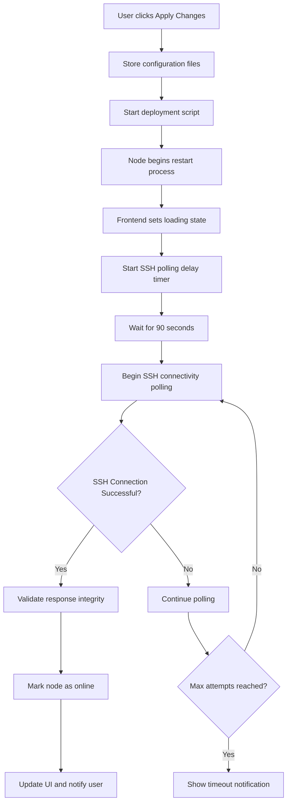
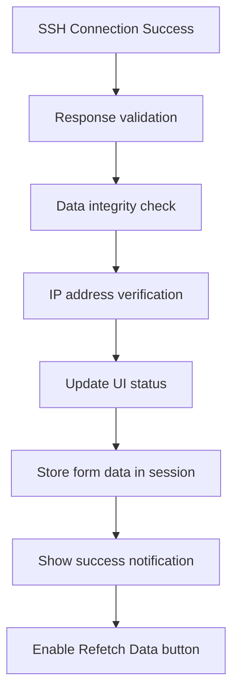
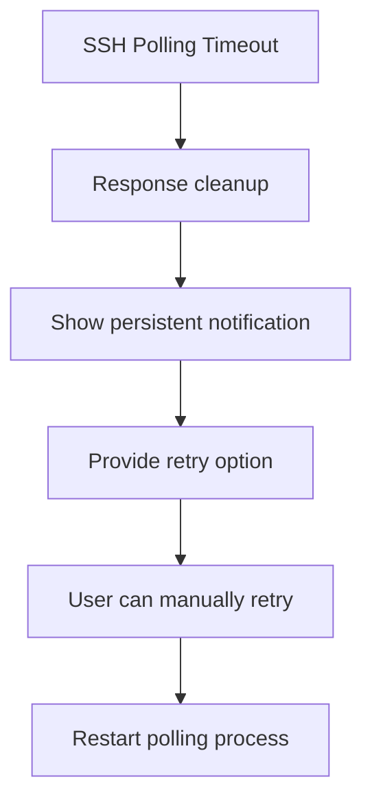
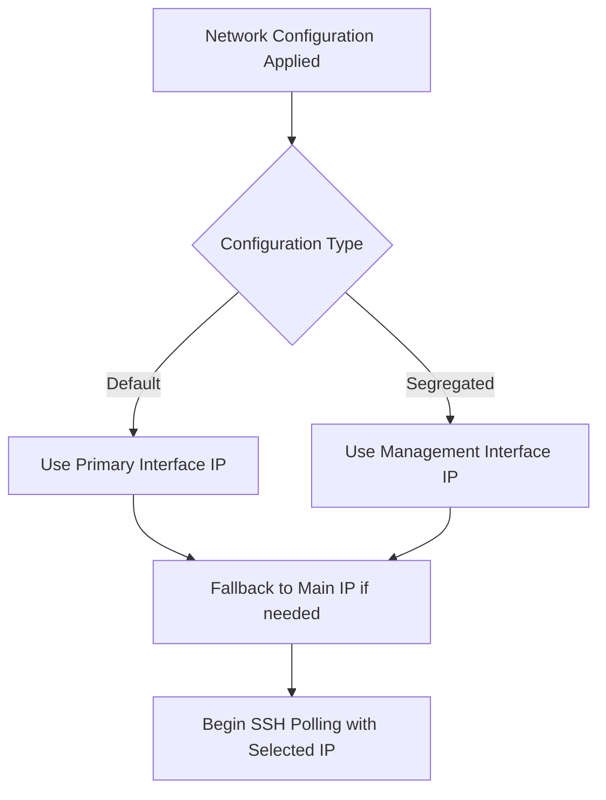

# Enhanced SSH Polling Workflow

This document outlines the enhanced SSH polling workflow that ensures reliable communication between backend and frontend, preventing response loss.

## Workflow Overview

## Detailed Workflow Steps

### 1. Initial Configuration Application
1. User clicks "Apply Changes" button
2. Configuration data is stored in JSON files
3. Deployment script is automatically started
4. Node begins restart process
5. Frontend sets loading state and starts polling delay

### 2. Delayed SSH Polling
- **Delay Period**: 90 seconds to allow node to complete reboot
- **Polling Interval**: Every 5 seconds
- **Maximum Attempts**: 120 polls (~10 minutes total)

### 3. SSH Connection Process
1. **TCP Port Check**: Verify port 22 is reachable
2. **SSH Authentication**: Use standardized key-based authentication
3. **Connection Parameters**: 
   - Connection timeout: 10 seconds
   - Banner timeout: 30 seconds
   - Authentication timeout: 15 seconds
4. **Command Test**: Execute simple echo command to verify functionality

### 4. Response Handling and Validation

#### Backend Response Enhancement
- Added response timestamp for tracking
- Response validation flags to ensure data integrity
- Metadata for debugging and monitoring

#### Frontend Response Validation
- **Retry Mechanism**: Up to 3 retries with 2-second delays
- **Response Timeout**: 10-second timeout for each request
- **Data Validation**: Validate response structure and IP matching
- **Error Handling**: Enhanced error messages with recovery options

### 5. Success Path with Enhanced Reliability

### 6. Timeout Path with Enhanced Feedback

## Key Enhancements for Response Reliability

### 1. Response Retry Mechanism
- **Retry Count**: 3 attempts for failed responses
- **Retry Delay**: 2 seconds between attempts
- **Timeout Handling**: 10-second timeout per request

### 2. Data Validation
- **Structure Validation**: Ensure response has required fields
- **IP Verification**: Confirm response matches expected IP
- **Timestamp Tracking**: Track when responses were generated

### 3. Error Handling Improvements
- **Enhanced Error Messages**: More descriptive error information
- **Recovery Options**: Clear retry mechanisms
- **User Feedback**: Better notifications for different scenarios

### 4. Resource Management
- **Connection Cleanup**: Proper SSH connection closing
- **Memory Management**: Cleanup of old polling results
- **Session Storage**: Efficient use of browser storage

## Configuration Values

### SSH Connection Parameters
- **Connection Timeout**: 10 seconds
- **Banner Timeout**: 30 seconds
- **Authentication Timeout**: 15 seconds
- **Command Execution Timeout**: 30 seconds

### Polling Parameters
- **Poll Delay**: 90 seconds
- **Poll Interval**: 5 seconds
- **Maximum Polls**: 120 polls (~10 minutes total)

### Response Reliability Parameters
- **Response Retry Count**: 3 attempts
- **Response Retry Delay**: 2 seconds
- **Response Timeout**: 10 seconds
- **Result Persistence**: 60 seconds for success/timeout results

## IP Selection Strategy

The system intelligently selects the correct IP for SSH polling based on network configuration:

## Error Handling and Recovery

### Common Error Scenarios
1. **Connection Refused**: Node not accepting connections
2. **Network Unreachable**: Network connectivity issues
3. **Authentication Failed**: SSH key or user issues
4. **Response Timeout**: Backend not responding in time
5. **Data Validation Failed**: Response structure issues

### Recovery Mechanisms
1. **Automatic Retries**: Built-in retry logic for transient errors
2. **Manual Retry Option**: User-initiated retry through notifications
3. **Timeout Handling**: Graceful handling of prolonged connection issues
4. **Resource Cleanup**: Proper cleanup of connections and timers

## Benefits of Enhanced Workflow

1. **Reliability**: Reduced chance of response loss between backend and frontend
2. **User Experience**: Better feedback and recovery options
3. **Debugging**: Enhanced logging and monitoring capabilities
4. **Maintainability**: Standardized approach across components
5. **Performance**: Optimized timeout values and retry mechanisms

This enhanced workflow ensures that SSH polling results are reliably delivered to the user interface, preventing the loss of important status updates during the node deployment process.